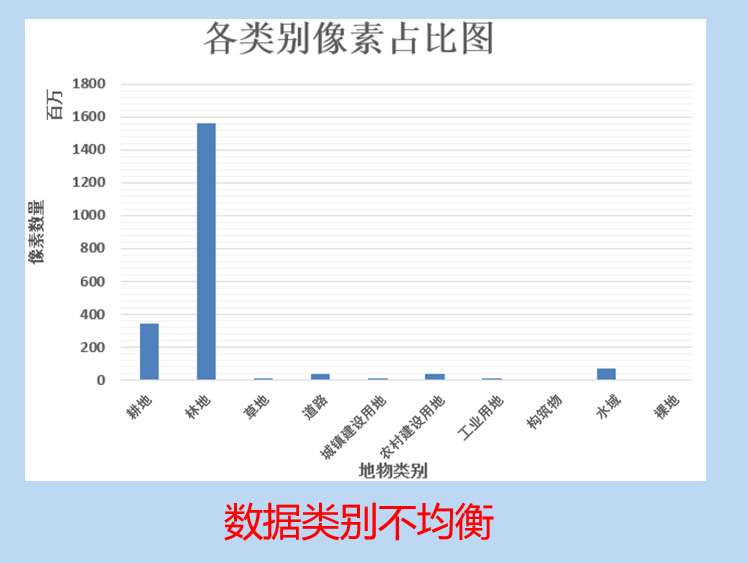
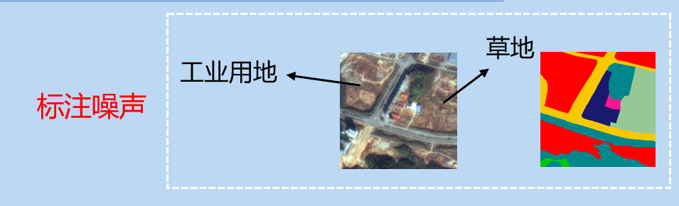
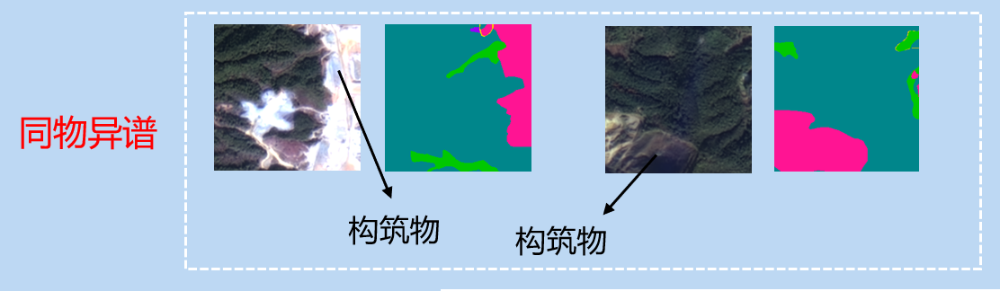
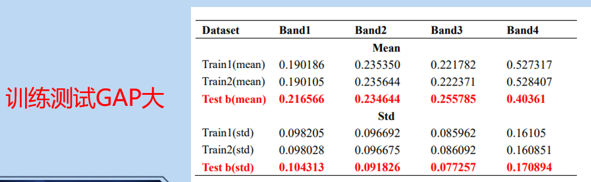
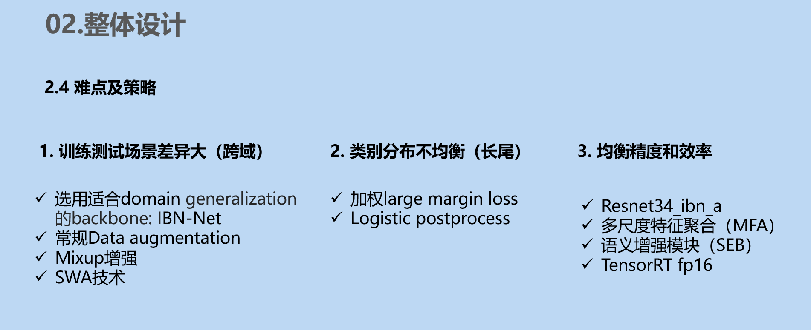
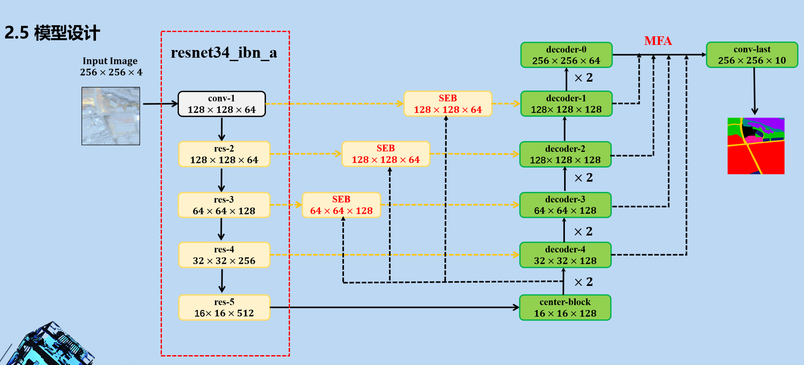
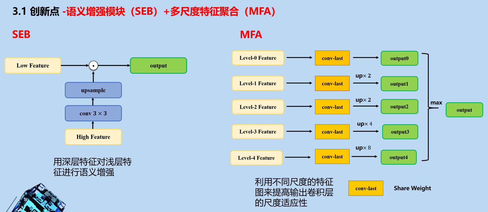
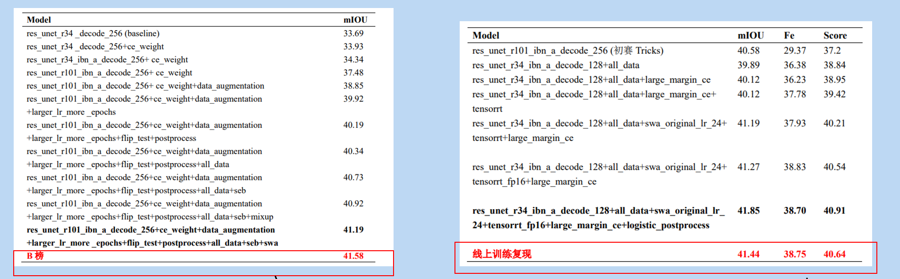

# Top3 solution of Tianchi competition in 2021 
https://tianchi.aliyun.com/competition/entrance/531860/introduction

## Data Analyse
### categories
 | index | label | gary |
 | :-----| ----: | :----: |
 | 1 | 耕地 | 1 |
 | 2 | 林地 | 2 |
 | 3 | 草地 | 3 |
 | 4 | 道路 | 4 |
 | 5 | 城镇建设用地 | 5 |
 | 6 | 农村建设用地 | 6 | 
 | 7 | 工业用地 | 7 | 
 | 8 | 构筑物 | 8 | 
 | 9 | 水域 | 9 | 
 | 10 | 裸地 | 10 |    

### main problems
#### Unbalanced categories   

  
#### label noise  

  
#### same object with different spectrums  
  

#### gap of train and test

To solve the above problems, we have designed the following solutions:   
   

## Model
In the competition, we choose Res-UNet as the baseline model.To improve the generalization ability of the model, we choose ibn-net as the backbone.
The structure of our network is as follows:

## Tricks and experiment
- Data augmentation(RandomRotate90/ShiftScaleRotate/RGBShift etc.)
- MixUp
- SWA
- LargeMarginSoftmax Loss
- Ibn-net
- Logist postprocess
